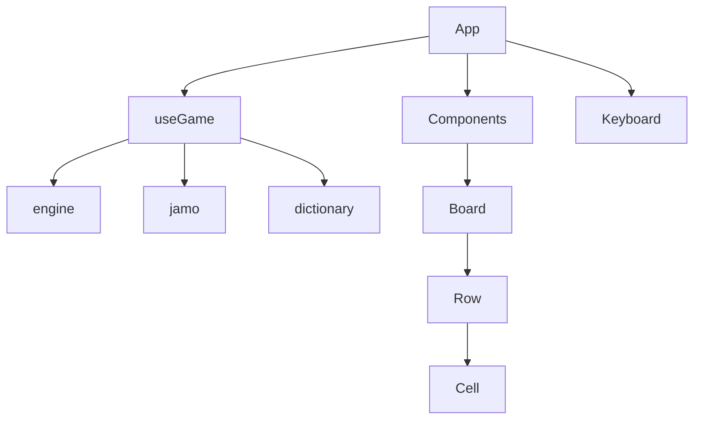

# AGENTS.md — Hangul Wordle

이 문서는 이 저장소에서 작업하는 코딩 에이전트를 위한 가이드입니다. 변경 전에 반드시 읽어 주세요.

## 프로젝트 개요

한글 Wordle 웹 게임입니다. **2음절 한글 단어**를 맞히며, 복합모음을 기본 자모로 펼쳤을 때 **정확히 5칸**이 되는 단어만 사용합니다. 최대 **5번** 시도할 수 있습니다.

- 프론트엔드 단일 SPA (백엔드 없음)
- UI 텍스트는 한국어
- 개인 프로젝트 (라이선스: README 참고)

## 빠른 시작

```bash
npm install
npm run dev      # http://localhost:5173
npm run build    # tsc -b && vite build
npm run lint
npm run preview
```

변경 후 최소한 `npm run build`와 `npm run lint`로 검증하세요. 자동 테스트 스위트는 없습니다.

## 기술 스택

| 영역 | 선택 |
|------|------|
| UI | React 19, TypeScript (strict) |
| 빌드 | Vite 8 |
| 스타일 | Tailwind CSS 4 (`@tailwindcss/vite`, `@theme` in `globals.css`) |
| 상태 | `useReducer` 기반 커스텀 훅 (`useGame`) |

## 디렉터리 구조

```
src/
├── App.tsx                 # 레이아웃, 모달, 물리 키보드 이벤트
├── components/             # Board, Row, Cell, Keyboard, Modal, Header
├── game/
│   ├── types.ts            # GameState, Evaluation, WordEntry
│   ├── engine.ts           # 추측 판정 (Wordle 규칙)
│   ├── jamo.ts             # 자모·복합모음·키보드 레이아웃
│   └── dictionary.ts       # 단어 사전 (lazy import 대상)
├── hooks/
│   └── useGame.ts          # 게임 상태·액션·애니메이션
└── styles/
    └── globals.css         # Tailwind @theme, 애니메이션, 전역 스타일
```

## 핵심 도메인 규칙 (반드시 지킬 것)

### 1. 5칸 보드와 자모 펼치기

게임 보드는 **기본 자모 5개** 기준입니다. 사전의 `jamos`는 음절 단위 자모 배열이지만, 실제 게임 `seed`는 `expandJamos()`로 펼친 결과입니다.

```typescript
// dictionary.ts — 등록 시
{ jamos: ["ㅈ", "ㅘ", "ㅍ", "ㅛ"], hangul: "좌표" }
// expandJamos → ["ㅈ", "ㅗ", "ㅏ", "ㅍ", "ㅛ"] (5칸)
```

- 새 단어 추가 시 `isPlayableWord(jamos)`를 통과해야 합니다 (`dictionary.ts`에서 자동 필터).
- 복합모음 분해 규칙은 `jamo.ts`의 `VOWEL_DECOMPOSITION`이 단일 진실 원천입니다.
- 키보드에 없는 자모는 입력·정답 모두 불가입니다.

### 2. 추측 판정

`engine.ts`의 `evaluate(guess, seed)`:

1. 먼저 위치 일치 → `correct` (초록)
2. 남은 자모 중 위치 불일치 → `present` (노랑)
3. 중복 자모는 Wordle과 동일하게 개수 제한

판정은 **펼친 자모 기준**으로 이루어집니다. `seed`와 `guess` 모두 5개 문자열 배열입니다.

### 3. 게임 상태 흐름

```
입력(PRESS_KEY) → 5칸 채움 → SUBMIT → evaluate → animating=true
→ 타임아웃 → REVEAL_ROW → status: playing | won | lost
```

- `animating` 중에는 입력·삭제·제출 불가
- `dictionary.ts`는 `useGame`에서 **dynamic import**로 로드 (초기 번들 분리)
- `NEW_GAME` 시 `seed: expandJamos(word.jamos)`, `display: word.hangul`

### 4. 키보드 색상

`useGame`의 `keyboardColors()`가 모든 추측을 순회하며 키별 최고 등급을 유지합니다.

우선순위: `correct` > `present` > `absent`

## 코딩 규칙

### TypeScript / import

- `tsconfig.json`: `strict: true`, `verbatimModuleSyntax: true`
- **상대 import는 `.js` 확장자 사용** (TypeScript 소스 기준)

```typescript
import { evaluate } from '../game/engine.js';
import type { GameState } from '../game/types.js';
```

- `type` import는 `import type` 사용
- 불필요한 추상화·과도한 에러 처리 추가 지양. 기존 패턴을 따르세요.

### React

- 함수형 컴포넌트만 사용
- 게임 로직은 UI가 아닌 `game/` + `hooks/useGame.ts`에 둡니다
- `App.tsx`는 조합·이벤트 연결 역할; 판정/자모 규칙은 `game/`에 유지

### 스타일

- Tailwind 유틸리티 클래스 우선
- 게임 색상은 `globals.css`의 `@theme` 토큰 사용:
  - `bg-game-correct`, `bg-game-present`, `bg-game-absent`
  - `bg-game-bg`, `text-game-text`, `font-display` 등
- 새 색상이 필요하면 `@theme`에 추가하고 컴포넌트에서 토큰 참조

### UI 텍스트

- 사용자-facing 문자열은 한국어 유지
- 모달·규칙 설명은 `App.tsx`와 README의 설명과 일치시킬 것

## 자주 하는 작업

### 단어 추가

`src/game/dictionary.ts`의 `allWords`에 `WordEntry` 추가:

```typescript
{ jamos: ["ㄱ", "ㅏ", "ㅁ", "ㅅ", "ㅏ"], hangul: "감사", meaning: "thanks" }
```

- `jamos`: 음절별 자모 (복합모음 그대로 가능)
- `hangul`: 화면에 표시할 한글
- `meaning`: 선택 (주석·향후 UI용)
- `isPlayableWord` 실패 시 `words` 배열에 포함되지 않음 — 추가 후 `expandJamos` 결과가 5칸인지 확인

### 게임 규칙 변경

| 변경 내용 | 수정 위치 |
|-----------|-----------|
| 시도 횟수, 보드 크기 | `useGame.ts`, `Board.tsx`, `types.ts` |
| 색상 판정 | `engine.ts` |
| 복합모음·키보드 키 | `jamo.ts` |
| 애니메이션 타이밍 | `useGame.ts` (`FLIP_DURATION`, `animationDelays`) |
| 셀·플립 UI | `Cell.tsx`, `Row.tsx`, `globals.css` |

규칙/UI 설명을 바꿀 때 README.md와 `App.tsx` 규칙 모달도 함께 업데이트하세요.

### 새 UI 컴포넌트

- `src/components/`에 추가
- props는 좁게 정의; 게임 상태가 필요하면 `GameState` 타입 재사용
- `Board` → `Row` → `Cell` 계층 패턴 유지

## 하지 말아야 할 것

- `seed`에 `expandJamos` 없이 raw `jamos`를 넣지 말 것
- `jamo.ts`와 별도로 복합모음 분해 로직을 중복 구현하지 말 것
- 백엔드·인증·DB·환경 변수 의존성을 임의로 추가하지 말 것
- `dist/`, `node_modules/` 수정하지 말 것
- 사용자가 요청하지 않은 README/AGENTS.md 대규모 개편·불필요한 테스트 추가 지양
- git commit/push는 사용자가 명시적으로 요청할 때만

## 배포·설정 참고

- `vite.config.ts`: React + Tailwind Vite 플러그인, `allowedHosts: ['vraptor.local']`
- 빌드 산출물: `dist/`
- ESLint flat config: `eslint.config.js` (`dist` 무시)

## 아키텍처 요약



**관심사 분리:**

- `game/` — 순수 도메인 (React 무관, 테스트하기 쉬운 함수)
- `hooks/` — React 상태·부수 효과
- `components/` — 표현만 담당

## 추가 참고

- 사용자용 설명: [README.md](./README.md)
- 게임 방법·색상 의미는 README와 `App.tsx` 규칙 모달이 동일해야 함
